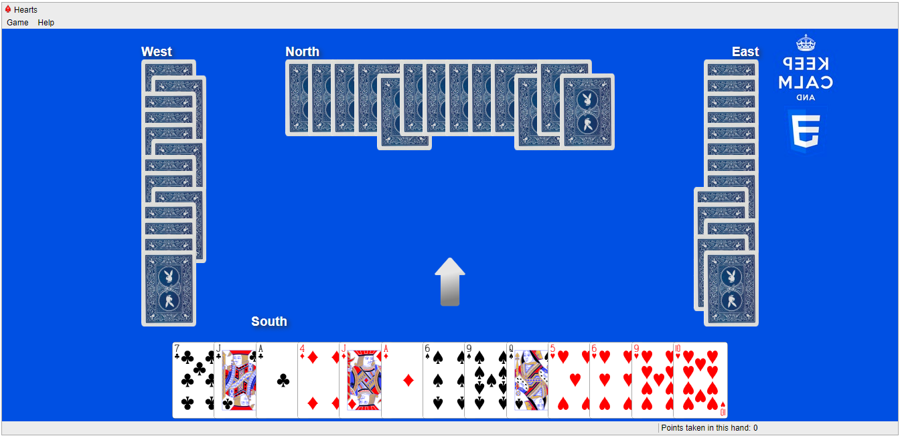

#  &#128148; Hearts Card Game

A React application of the Hearts card game inspired by the Microsoft Windows 7 Hearts card game. 

  
  This project was bootstrapped using Vite.

## Used Packages

| Package | Version | Description
|-----------------|-----------------|-----------------|
| [hook-me-up](https://www.npmjs.com/package/@letele/hook-me-up)| | A package with a handful of react hooks|
| [svg-icons](https://letele.github.io/svg-icons-app/)| | Colourful svg icons as react components |
| [ecmascripts](https://www.npmjs.com/package/@letele/ecmascripts)| | Helpful functions for manipulating JavaScript arrays |
| [playing-cards](https://www.npmjs.com/package/@letele/playing-cards)| | A collection of svg playing cards for react apps |

## Licence

[CC0 1.0 Universal](LICENSE)

